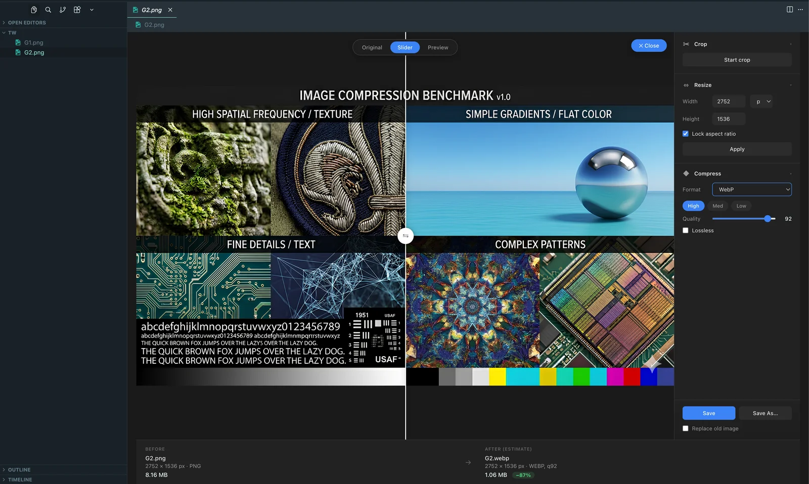

# Image Studio

Image editor + AI converter for VSCode. **Two ways to use one tool**, install whichever (or both):

- **AI (MCP server)** — Claude Code / Cursor / Claude Desktop converts images on your disk via natural language: *"convert all PNGs in /icons to webp quality 80"*.
- **GUI (VSCode extension)** — custom image editor tab with live Before/After preview, crop, resize, compress.

Both run locally through [sharp](https://sharp.pixelplumbing.com/). No uploads, no cloud, no telemetry.



---

## Use with Claude, Cursor, or Claude Desktop (MCP)

**Two commands** — no cloning, no building:

```bash
npm install -g image-studio-mcp
claude mcp add --transport stdio --scope user image-studio -- image-studio-mcp
```

The first command downloads [`image-studio-mcp`](https://www.npmjs.com/package/image-studio-mcp) from npm and compiles the native `sharp` binary for your platform. The second registers it with Claude Code. Restart your Claude Code session, then verify:

```bash
claude mcp list
# → image-studio: ✓ Connected
```

> **Why not `npx -y`?** It technically works, but the first-run cold start downloads sharp's native binary inside Claude Code's MCP handshake window and usually times out with `✗ Failed to connect`. Installing globally once avoids that.

**That's it.** Now ask Claude anything like:

- *"Convert all PNGs in /Users/me/icons/ to webp quality 80."*
- *"What's the size of /Users/me/photo.jpg?"*
- *"Resize /Users/me/banner.png to width 1200 keeping aspect ratio."*
- *"Crop the top-left 500×500 out of /Users/me/screenshot.png."*

Five tools exposed:

| Tool | What it does |
|---|---|
| `get_image_info` | Return width, height, format, and byte size of an image. |
| `convert_image` | Convert a single image between PNG / JPG / WebP / AVIF with optional quality. |
| `resize_image` | Resize by width, height, or both (aspect ratio preserved by default). |
| `crop_image` | Crop a rectangular region by pixel coordinates. |
| `batch_convert` | Apply a convert/resize pipeline to every file matching a glob. |

Full argument reference on the [npm page](https://www.npmjs.com/package/image-studio-mcp).

### Cursor / Claude Desktop

After `npm install -g image-studio-mcp`, add to your MCP config (`~/.cursor/mcp.json` or `claude_desktop_config.json`):

```json
{
  "mcpServers": {
    "image-studio": {
      "command": "image-studio-mcp"
    }
  }
}
```

### AI security constraints

Enforced at every tool call:

- **Absolute paths only** — no `..` traversal.
- **Max 100 MB per file.**
- **Globs need a concrete base directory** (`/Users/me/foo/**/*.png`, not bare `**/*.png`).
- **Overwrite protection** — `dst` existence check, requires explicit `overwrite: true` to replace.

---

## Use as a VSCode extension (GUI)

1. **Download** `image-studio-<your-platform>.vsix` from the [GitHub Releases](https://github.com/adammery/image-studio/releases) page.
2. **Install**:
   ```bash
   code --install-extension image-studio-<platform>.vsix
   ```
   (or drag the `.vsix` into a VSCode window)
3. **Use**:
   - Click the **Image Studio** icon in the Activity Bar (or press `Cmd+Shift+\` on Mac / `Ctrl+Shift+\` elsewhere).
   - Pick any PNG / JPG / WebP / AVIF from the sidebar tree.
   - Crop / Resize / Compress in the right panel. Watch the live Before/After size reduction badge.
   - Press **Save** (or tick "Replace old image" to trash the original on save).

Full feature list, keyboard shortcuts, and settings: [`packages/extension/README.md`](packages/extension/README.md).

> **Note on platforms.** The `.vsix` bundles sharp's native libvips binary, so each `.vsix` is OS- and CPU-specific. Currently only `darwin-arm64` (Apple Silicon Mac) is published. Need Linux / Windows / Intel Mac? [Open an issue](https://github.com/adammery/image-studio/issues) and I'll prioritize.

---

## Status

Stable, MVP feature-complete. 69 tests passing across core, MCP server, and extension.

## Repository layout

- `packages/core/` — sharp-based image operations (pure library, no VSCode/MCP deps)
- `packages/mcp-server/` — MCP server → published on npm as [`image-studio-mcp`](https://www.npmjs.com/package/image-studio-mcp)
- `packages/extension/` — VSCode extension → packaged as `.vsix`

## Development

Requires Node 20 LTS.

```bash
nvm use            # activate Node 20 from .nvmrc
npm install        # installs all workspace packages
npm test           # runs all package tests (69 expected)
npm run build      # compiles dist/ for all packages
```

### Running the MCP server from a local clone

Skips the npm registry — useful while hacking on the server:

```bash
npm run build
claude mcp add --transport stdio --scope user image-studio-dev \
  -- node /absolute/path/to/image-studio/packages/mcp-server/dist/index.js
```

Uses a different name (`image-studio-dev`) so it coexists with the published `image-studio` registration.

### Building a `.vsix` for the extension

```bash
cd packages/extension
./scripts/package.sh
code --install-extension image-studio.vsix
```

The script produces `image-studio.vsix` in `packages/extension/`. It bundles sharp for the host platform only.

## License

MIT
